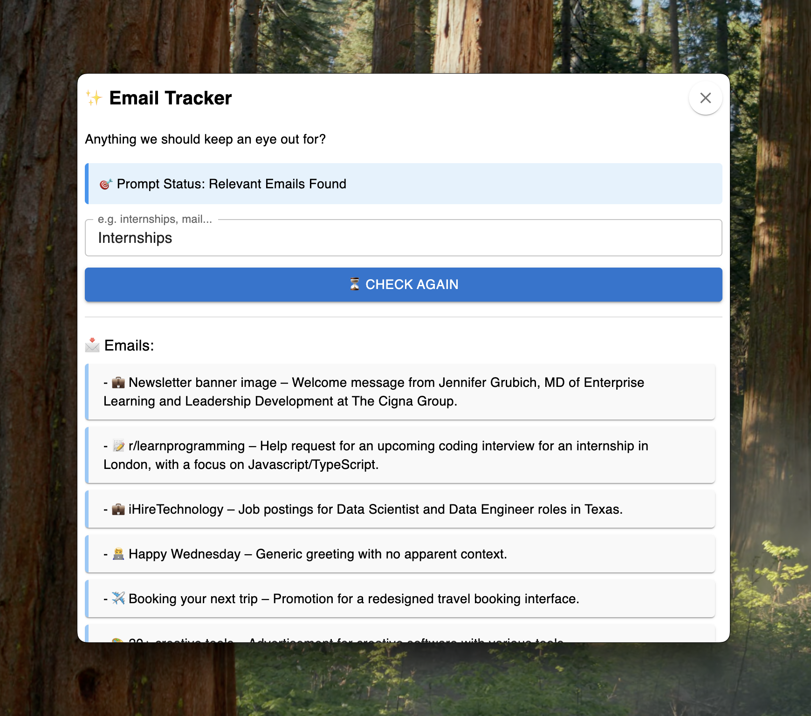

# 📬 Email Tracker

A minimalist desktop app that summarizes your unread Gmail messages using AI. You can also enter a keyword prompt (e.g., 'internship') to check if relevant emails are present. The app will notify you if any unread emails match the prompt.

## ✨ Features

- Built with **Electron** and **React**
- Summarizes **20 unread emails** with clean formatting and emojis
- Uses **Cohere's LLM** to create readable summaries
- Displays a **Prompt Status**: tells you if relevant emails based on your keyword were found
- Custom keyword prompt to **monitor specific topics** (e.g., "internship", "invoice")
- 🧹 Clean UI, close button, and scrollable list

## 📷 Screenshots



## 🔧 How it Works

1. Authenticates your Gmail via OAuth2.
2. Fetches the **20 most recent unread emails**.
3. Sends them to the backend to be summarized by **Cohere’s LLM**.
4. The **prompt** is used to **check for relevant emails**.
   - Example: if you type “internship” and one email mentions it, you’ll see 🎯 Prompt Status: Relevant Emails Found.

## 🛠 Tech Stack

- Electron
- React + Vite
- Material UI (MUI)
- Cohere LLM (command-r-plus)
- Google Gmail API (OAuth2)
- Node.js

## ▶️ Getting Started

1. Clone the repo
2. Install dependencies
3. Add your `credentials.json` and `.env` with `COHERE_API_KEY`
4. Run it:
   ```
   npm run dev
   ```
